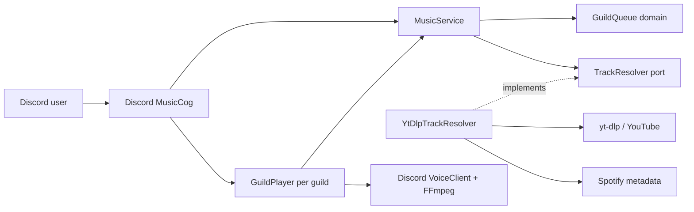
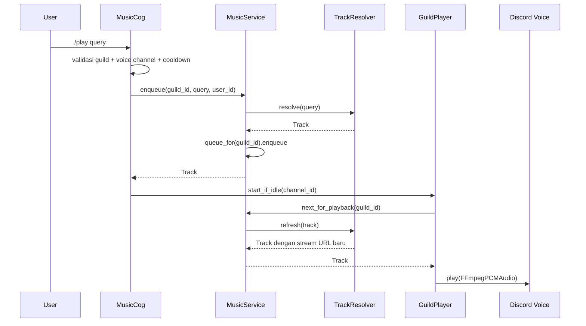

# Architecture

## 1. Prinsip

- Dependency mengarah ke dalam: adapter → application → domain.
- Domain tidak mengetahui Discord, yt-dlp, Spotipy, FFmpeg, environment, atau filesystem.
- State mutable dibatasi per guild dan dimiliki oleh service/player yang jelas.
- Network dan proses blocking tidak boleh berjalan langsung di event loop.
- Pesan pengguna aman; detail exception hanya masuk log operator.

## 2. Komponen

```text
index.py
└── discord_music_bot.main
    ├── config.Settings
    ├── adapters.discord.MusicBot / MusicCog / GuildPlayer
    │   └── application.MusicService
    │       ├── domain.GuildQueue / Track
    │       ├── application.TrackResolver (port)
    │       └── application.GuildSettingsService
    └── adapters.media.YtDlpTrackResolver
        ├── yt-dlp
        └── Spotipy
```



## 3. Lapisan dan Tanggung Jawab

### Domain

Lokasi: `src/discord_music_bot/domain/`

- `Track`: entitas media yang siap diputar.
- `GuildQueue`: aturan FIFO, kapasitas, preview, remove, move, shuffle, dan clear.
- Tidak boleh mengimpor `discord`, `yt_dlp`, `spotipy`, atau dotenv.

### Application

Lokasi: `src/discord_music_bot/application/`

- `TrackResolver`: port untuk resolusi media.
- `MusicService`: use case enqueue/playback/preview/mutasi queue dan isolasi queue per guild.
- Boleh memakai domain dan Python standard library saja.

### Adapters

Lokasi: `src/discord_music_bot/adapters/`

- `media`: implementasi resolver eksternal, timeout, allowlist URL, dan translasi error.
- `discord`: command/button dengan policy authorization bersama, player, FFmpeg, notification, dan lifecycle Discord.

### Composition Root

- `config.py` memvalidasi environment.
- `main.py` membangun dependency dan menjalankan bot.
- root `index.py` hanya kompatibilitas entry point.

## 4. Alur `play`



Callback dari audio thread masuk kembali ke event loop memakai `asyncio.run_coroutine_threadsafe`, lalu player mengambil track berikutnya. Idle disconnect memakai task terpisah sehingga lock tidak ditahan selama sleep.

## 5. Model State

| State | Pemilik | Scope | Lifecycle |
|---|---|---|---|
| Queue dan queue lock | `MusicService` | guild | dibuat lazy, dihapus saat bot meninggalkan guild; URL stream di-refresh setelah dequeue |
| Current track | `GuildPlayer` | guild | satu playback |
| Loop mode | `GuildPlayer` | guild | `off`, `track`, atau `queue`; reset ketika stop/leave |
| Transition lock | `GuildPlayer` | guild | selama player hidup |
| Idle task | `GuildPlayer` | guild | dijadwalkan ketika queue kosong |
| Spotify client | Resolver | process | selama process hidup |
| Guild settings | `GuildSettingsService` | guild | in-memory sampai repository BOT-201 tersedia |

Tidak boleh menambahkan state musik global baru. Semua state playback baru harus memiliki `guild_id` sebagai batas isolasi.

## 6. Error Handling

- Domain melempar error aturan bisnis seperti `QueueFullError`.
- Adapter media menerjemahkan exception vendor menjadi `MediaResolutionError` yang aman.
- Discord adapter menangani error yang diketahui dan mengirim pesan singkat.
- Exception tak terduga dicatat dengan stack trace tanpa token atau query mentah.

## 7. Ekstensi yang Disetujui

- Fitur queue baru masuk domain/application lebih dulu, baru command adapter.
- Provider media baru mengimplementasikan port baru atau `TrackResolver` composite.
- Persistence queue menggunakan port repository di application; SQLite/Redis menjadi adapter.
- Konfigurasi guild menggunakan `GuildSettingsRepository`, bukan environment per guild.
- Metrics menggunakan port telemetry dengan no-op default.

## 8. Deployment

Container memasang FFmpeg, dependency Python terpin, dan berjalan sebagai UID non-root. Compose memakai filesystem read-only, tmpfs terbatas, tanpa Linux capabilities, dan `no-new-privileges`. Secret tetap diberikan saat runtime melalui `.env`; produksi sebaiknya berpindah ke secret manager.
